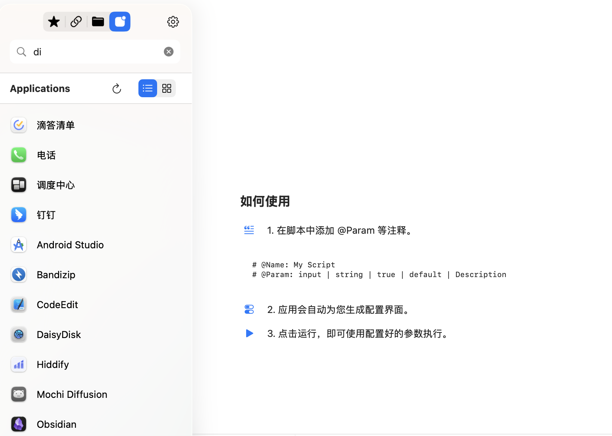

# 🚀 ScriptManager | 脚本管理器

**管理和运行你的常用的脚本，一键运行，个性化定制。**  
**瞬间将你的命令行脚本转化为精美的原生 macOS 图形界面应用。**  
*无需编写任何 UI 代码，只需添加几行魔法注释。100% SwiftUI 打造。*

[](#)
[](#)
[](#)
[](#)

[English](./README.md) | [简体中文](./README_zh.md)

</div>

---

## 💡 亮点

别再为了给团队分享一个脚本，而去苦哈哈地写一堆 UI 样板代码或者搭建复杂的 Web 后台了。有了 **ScriptManager**，你只需要像往常一样编写脚本（Bash, Python, Node.js, Ruby），加上几行注释，然后一个原生的脚本执行配置界面就自动生成了！在界面上直接配置参数运行。

**之前（你的脚本）：**
```python
#!/usr/bin/env python3
# @Name: 数据库导出工具
# @Desc: 安全地将生产环境数据库导出为本地 CSV 文件。
# @Param: target_db | choice | true | users | 选择数据库 | users, orders, logs
# @Param: output_dir | path | true | | 导出目标路径
# @Param: verbose | bool | false | false | 开启详细日志

import sys
# ... 你的核心业务逻辑 ...
```

**之后（ScriptManager 自动生成的 UI）：**




---

## ✨ 核心特性

- 🪄 **UI 自动生成**：智能解析 `@Param` 注释，自动生成文本框、下拉菜单、文件选择器和开关控件。
- 💻 **交互式 PTY 终端**：内置支持完整伪终端（PTY）的控制台。完美支持 `sudo` 密码输入、`mysql`、`ssh` 或 `npm init` 等交互式命令。
- 📁 **工作区管理**：以文件夹形式组织脚本。实时文件系统监控，确保 UI 与底层文件时刻保持同步。
- 📝 **内置代码编辑器**：随时随地修改脚本。支持语法高亮（Python, Bash, Node.js, Ruby）、自动缩进以及标准快捷键（`Cmd+S`, `Cmd+/`, `Cmd+F`）。
- 🌍 **独立环境变量**：为每个脚本注入专属的环境变量，再也不用把全局的 `~/.zshrc` 搞得一团糟。
- 🔒 **原生与隐私优先**：100% 原生 SwiftUI 编写。告别 Electron 的臃肿，纯本地运行，无云端同步，你的脚本绝对安全。

---

## 📦 安装指南

### 选项 1：直接下载
前往 [Releases](https://github.com/your-username/ScriptManager/releases) 页面下载最新的 `.zip` 或者 `.dmg` 文件，解压后并将其拖入“应用程序 (Applications)”文件夹。

### 选项 2：源码编译
```bash
git clone https://github.com/your-username/ScriptManager.git
cd ScriptManager
open ScriptManager.xcodeproj
# 在 Xcode 中按下 Cmd + R 编译并运行
```

---

## ⚠️ 常见问题：提示“App已损坏，无法打开”或“无法验证开发者”？

由于 ScriptManager **移除了 macOS 沙盒限制**（为了提供完整的终端执行权限和底层文件访问能力），且可能未进行 Apple 开发者签名，macOS 的 Gatekeeper 安全机制可能会拦截应用的运行。

如果您在打开应用时遇到“已损坏”、“无法打开”或“未知的开发者”等提示，请在终端（Terminal）中执行以下命令：

```bash
# 1. 允许任何来源的应用运行（针对未签名应用的常规设置）
sudo spctl --master-disable

# 2. 移除应用的隔离属性（解除安全限制的关键步骤）
sudo xattr -r -d com.apple.quarantine /Applications/ScriptManager.app
```
*注意：在执行第二条命令前，请确保您已经将 App 拖入了 `/Applications` (应用程序) 文件夹。*

---

## 🚀 快速开始

1. 打开 **ScriptManager**，点击 **"打开工作区 (Open Workspace)"** 选择一个本地文件夹。
2. 点击 **"+"** 按钮创建一个新脚本（例如 `hello.py`）。
3. 在内置编辑器中粘贴以下代码：

```python
#!/usr/bin/env python3
# @Name: Hello World 生成器
# @Param: name | string | true | 开发者 | 你想向谁问好？
# @Param: enthusiastic | bool | false | true | 是否添加感叹号？

import sys

name = sys.argv[1] if len(sys.argv) > 1 else "World"
enthusiastic = "--enthusiastic" in sys.argv

greeting = f"你好, {name}"
if enthusiastic:
    greeting += "!!!"

print(greeting)
```
4. 按下 `Cmd + S` 保存。
5. 切换到 **配置 (Config)** 标签页，填写自动生成的表单，然后点击 **运行 (Run)**！

---

## 📖 语法指南

ScriptManager 通过解析脚本头部注释中的特定契约来生成 UI。

### 元数据标签
| 标签 | 描述 | 示例 |
|-----|-------------|---------|
| `@Name:` | 脚本的显示名称 | `# @Name: 部署服务器` |
| `@Desc:` | 简短描述 | `# @Desc: 将应用部署到 AWS` |
| `@Author:` | 作者名称 | `# @Author: 张三` |
| `@Version:`| 脚本版本 | `# @Version: 1.0.0` |
| `@Example:`| 使用示例 | `# @Example: 勾选详细日志以排查问题` |

### 参数标签 (`@Param`)
`@Param` 标签是 ScriptManager 的核心。它遵循严格的管道符 `|` 分隔格式：

```text
@Param: 参数名 | 类型 | 是否必填 | 默认值 | 描述 | 选项 (仅限 choice 类型)
```

#### 支持的类型：
1. **`string`**：生成标准的文本输入框。
   ```bash
   # @Param: api_key | string | true | | 请输入您的 API Key
   ```
2. **`bool`**：生成开关控件。如果开启，执行时会自动向脚本传递 `--参数名`。
   ```bash
   # @Param: dry_run | bool | false | true | 试运行（不修改实际数据）
   ```
3. **`path`**：生成带有“选择文件/文件夹”按钮的路径输入框。
   ```bash
   # @Param: input_csv | path | true | | 选择要处理的数据文件
   ```
4. **`choice`**：生成下拉菜单。必须提供第 6 个参数（用逗号分隔的选项列表）。
   ```bash
   # @Param: env | choice | true | dev | 目标环境 | dev, staging, prod
   ```

---

## 🛠️ 架构亮点

致对源码感兴趣的开发者：
- **多重 FDA 探测机制**：高级的完全磁盘访问权限（Full Disk Access）检测，完美绕过 macOS 沙盒缓存 Bug。
- **PTY 伪终端分配**：底层调用 `posix_openpt` 和 `grantpt` 分配真实的伪终端，精准捕获 ANSI 颜色代码，并完美支持交互式标准输入（如 `sudo` 密码拦截）。
- **Security-Scoped Bookmarks**：利用安全作用域书签机制，在 App 重启后持久化工作区访问权限，彻底解决沙盒权限丢失问题。
- **流式解析引擎**：异步读取文件的前几 KB 提取元数据，即使面对 GB 级别的超大日志文件也能保证 UI 零卡顿。
- **快速拼音搜索**：支持多种搜索方式，快速定位你的脚本和应用。

---

## 📄 License

 支持 MIT License.
